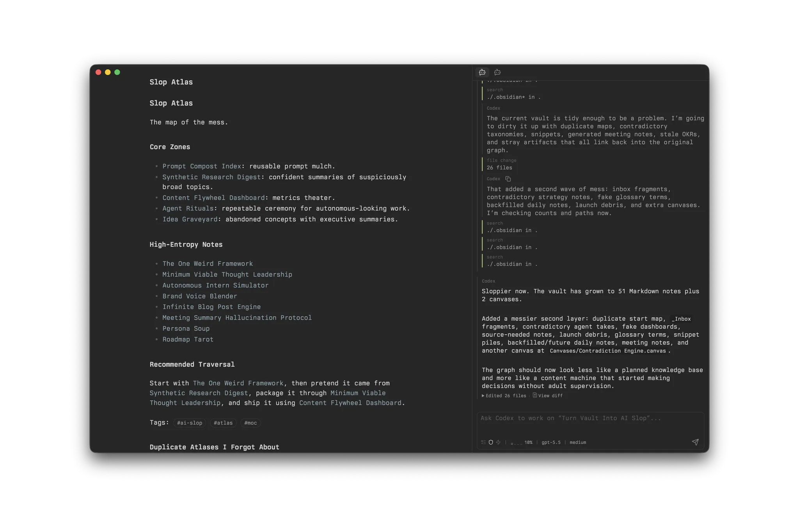

# Codex Panel

Codex Panel brings Codex into an Obsidian sidebar. It keeps Codex threads beside your notes, helps you add vault context to prompts, and lets you handle approvals and file changes without switching windows.

If the Codex CLI is already installed and authenticated, Codex Panel uses that local setup.

## Why use it

- Keep Codex work next to the notes or projects it is about.
- Bring notes, selections, links, and attachments into prompts.
- Manage threads and respond to Codex requests inside Obsidian.
- Review file changes, rewrite selected note text, and archive useful threads as notes.

## How it works

Codex Panel starts `codex app-server` locally. Each open panel keeps its own active thread and draft, with Codex working from the vault root.

Codex Panel stores panel preferences only, not API keys or provider credentials.

## Requirements

- Obsidian desktop app 1.12.0 or newer.
- Codex CLI installed, authenticated, and available as `codex`, or configured with an absolute executable path in Codex Panel settings.
- A local vault where Codex is allowed to work.

Codex Panel does not support Obsidian mobile.

## Installation

Install Codex Panel from Obsidian's Community plugins browser by searching for **Codex Panel**, then install and enable the plugin.

You can also open the plugin page directly: <https://community.obsidian.md/plugins/codex-panel>.

## Quick start

1. Open the note or project you want to work on.
2. Run **Codex Panel: Open panel** from the command palette, or select the ribbon icon.
3. In the composer, reference what matters and describe the outcome you want. For example: `@active Summarize this note and suggest the next three actions.`
4. Follow the turn in the panel, respond to requests when needed, and review any file changes before continuing.

If Obsidian cannot find `codex`, set **Settings -> Codex Panel -> Codex executable** to an absolute path such as `/opt/homebrew/bin/codex`.

## Working with Codex Panel

### Keep work separate or pick it up later

A panel is an independent working surface with its own active thread and draft. Open multiple panels when different tasks should stay visible and separate. Regular Codex threads remain available after a panel closes; return to them from **Codex Panel: Open thread...**, panel history, or the Threads view.

For a one-off question alongside the current thread, use `/btw` to open a temporary side chat. To carry context between regular threads without merging their histories, use `/refer <thread> <message>`. The submitted message keeps a normal link to the referenced thread; clicking it opens the thread in an available Codex Panel, creating one when needed.

### Bring in the right context

The composer lets you point Codex to relevant material without pasting it into the prompt. Type wikilinks to reference vault files while keeping their names readable. Use `@active` for the active file or `@selection` for the current Markdown selection.

When Obsidian Daily Notes or the daily section of Periodic Notes is enabled, `@today`, `@tomorrow`, and `@yesterday` resolve through its folder and date format. Paste or drop files to save them in the configured attachment folder and reference them from the same prompt. For material outside the vault, `/web <url> [message]` fetches readable page content and attaches it to the next turn without creating a note.

### Guide a running turn

As a turn runs, the panel keeps the conversation together with requests that need your attention. You can answer questions, approve or reject actions, steer the turn with another message, or interrupt it. Plans, goals, tool activity, and agent work remain available when you need to inspect how the task is progressing.

### Review and keep the result

When Codex changes files, open the Obsidian diff view to review the changes and copy the patch. For a focused edit, select Markdown text and run **Codex Panel: Rewrite selection** to request a replacement and review a selection-scoped diff before applying it.

Archive a finished thread with or without saving it as a Markdown note. Saved notes use the configured folder, filename template, and tags; archived threads can later be restored or permanently deleted from settings.

Use `/help` for the current slash command list.

## Compatibility

| Key                                    | Version   | Policy                                                                                              |
| -------------------------------------- | --------- | --------------------------------------------------------------------------------------------------- |
| `manifest.minAppVersion`               | `1.12.0`  | Minimum Obsidian desktop version declared for plugin loading.                                       |
| `obsidian` API types                   | `1.12.3`  | TypeScript API package used for compile-time checks; kept in the same minor as `manifest` baseline. |
| `codexAppServer.testedCliVersion`      | `0.146.0` | Exact CLI patch used to generate and verify bindings; compatibility is tracked by minor version.    |

Codex Panel depends on the experimental `codex app-server` API.

## License

Codex Panel is licensed under the Apache License 2.0. See `LICENSE`.

The generated TypeScript bindings under `src/generated/app-server/` are generated from OpenAI Codex CLI app-server types. See `NOTICE` for upstream attribution.
